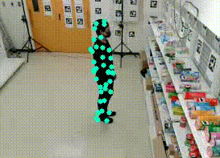

# Retail Behavior Dataset (FG 2025) 🚀


## Overview
Welcome to the **Retail Store Actions Dataset**, part of the research presented in the paper:

📄 **"Evaluating Data Quality and Processing Techniques to Enhance Skeleton-Based Action Recognition in Retail Stores"**  
Accepted at the **19th IEEE International Conference on Automatic Face and Gesture Recognition (FG 2025)**.

This dataset enables research on action recognition under real-world occlusion, keypoint noise, and retail surveillance conditions. It provides:

- ✅ 220 synchronized video clips recorded in a retail-style aisle.
- ✅ 3D skeletal data captured using an **OptiTrack** motion capture system.
- ✅ 2D keypoints extracted using **YOLOv8-Pose** and **projected MoCap** data.
- ✅ Both **raw** and **compensated** keypoint trajectories included.

---

### 👀 Sneak Peek – What the Dataset Looks Like

| 2D MoCap Keypoints Overlay | Synchronized RGB Frame |
|----------------------------|------------------------|
|  |  |

> Left: 2D projection of 3D MoCap keypoints overlaid on the RGB frame.  
> Right: Raw synchronized RGB frame used for pose estimation input.

---

### 📂 What to Expect

The dataset is structured to support reproducible experiments in pose-based action recognition. It will include:

1. **Raw Synchronized Data**  
   - RGB videos (H.264 format)  
   - MoCap 3D marker data (.csv/.npy)

2. **Compensated Synchronized Data**  
   - Processed 2D/3D keypoints with smoothing, interpolation, and augmentation.

3. **Metadata**  
   - Class labels, camera calibration details, subject/action breakdown.

4. **Scripts**  
   - Python preprocessing pipeline (interpolation, normalization, smoothing)  
   - Sample action recognition model integration (STGCN-ready format)

---

### 📥 Request Access

This dataset is currently distributed **by request only**.  
If you're interested in using it for academic or research purposes:

📧 **Contact:** yousef.samer.akram.yacoub.p2@dc.tohoku.ac.jp  
📄 **Include:** Name, Affiliation, Project Description, and Expected Use.

---

### 🔒 License

This dataset will be made available under the [**Creative Commons Attribution 1.0 International (CC BY 1.0)**](https://creativecommons.org/licenses/by/4.0/).

You are free to:

- Share — copy and redistribute the material in any medium or format  
- Adapt — remix, transform, and build upon the material  

As long as you give **appropriate credit** and indicate if changes were made.

---

### 🖋 Citation

When using this dataset, please cite:
```
@inproceedings{yousef2025retail,
title     = {Evaluating Data Quality and Processing Techniques to Enhance Skeleton-Based Action Recognition in Retail Stores},
author    = {Samer Yousef, Chengjun Han, Naoya Chiba, Koichi Hashimoto},
booktitle = {Proceedings of the 19th IEEE International Conference on Automatic Face and Gesture Recognition (FG 2025)},
year      = {2025}
}
```
### 📧 Contact

For questions or collaborations:

✉️ **yousef.samer.akram.yacoub.p2@dc.tohoku.ac.jp**  
🧠 Interested in retail action recognition, pose estimation, or dataset benchmarking? Feel free to reach out.
